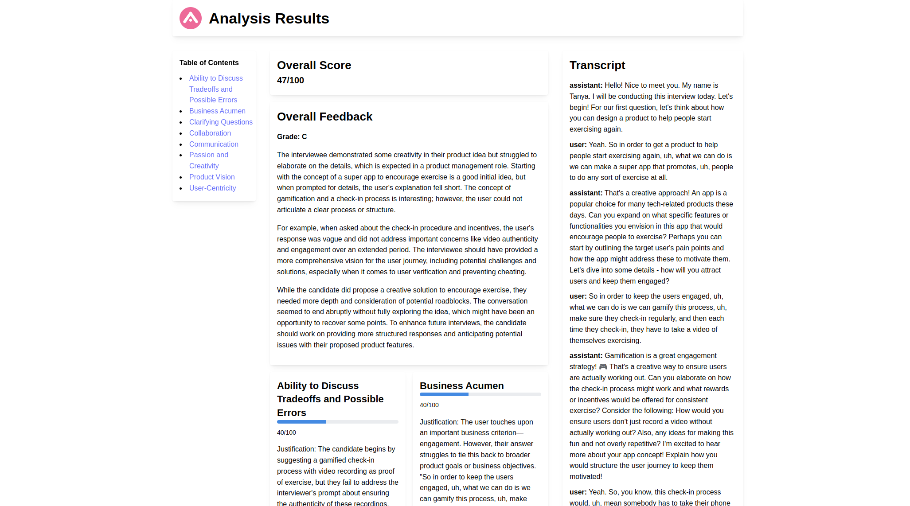

# LeetPro

## About LeetPro

LeetPro is an innovative platform that brings the community-driven learning approach of LeetCode to the rigorous world of finance, product management, and business interviews. Our mission is to help professionals prepare for high-stakes interviews through realistic AI-powered mock interviews and comprehensive feedback.

<details>
  <summary> Watch Video Demo </summary>
  
  
</details>

| Practice your Interview                                | Analyze after the fact                               |
| ------------------------------------------------------ | ---------------------------------------------------- |
|  |  |

### Key Features

- **AI-powered Mock Interviews**: Experience realistic interview simulations with our AI interviewer that adapts to your responses, asks follow-up questions, and mimics real interview scenarios.
- **Detailed Performance Analysis**: Receive an overall score and in-depth breakdown of your interview performance, including specific areas for improvement.

### Future Enhancements

We're continuously working to improve LeetPro. Future iterations may include:

- Analysis of non-verbal communication aspects such as confidence, personality, body language, and intonation.
- Enhanced community features to facilitate networking and collaborative learning.
- Up-to-date Question Bank: Browse a constantly evolving collection of interview questions, cases, and prompts sourced from our community and internal experts.
- Community Interaction: Learn from others by viewing shared answers and scores from fellow users (with their permission).
- Gamification: Engage with leaderboards, groups, and user profiles to connect with other professionals and enhance your learning experience.

Join LeetPro today and take your interview preparation to the next level!

## Setup

```bash
pnpm install
pnpm dev
```

Check out our backend repo [here](https://github.com/kevin51jiang/leetpro-mvp-backend)
